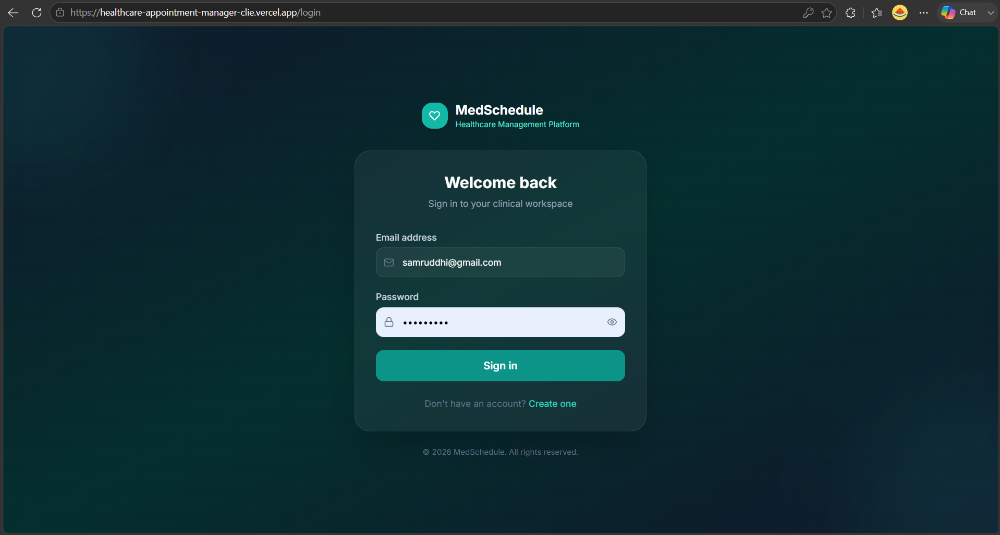
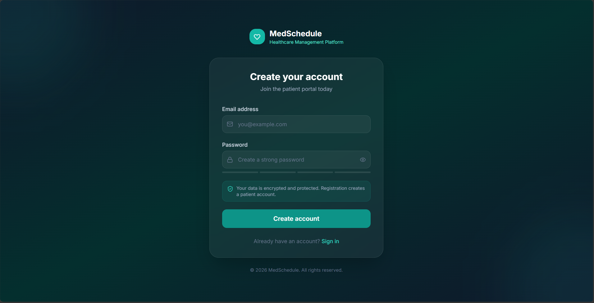
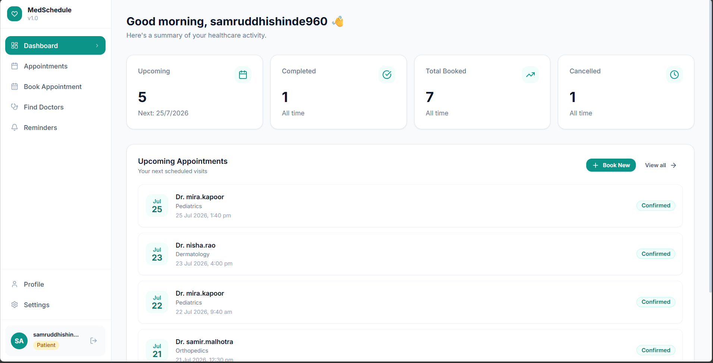
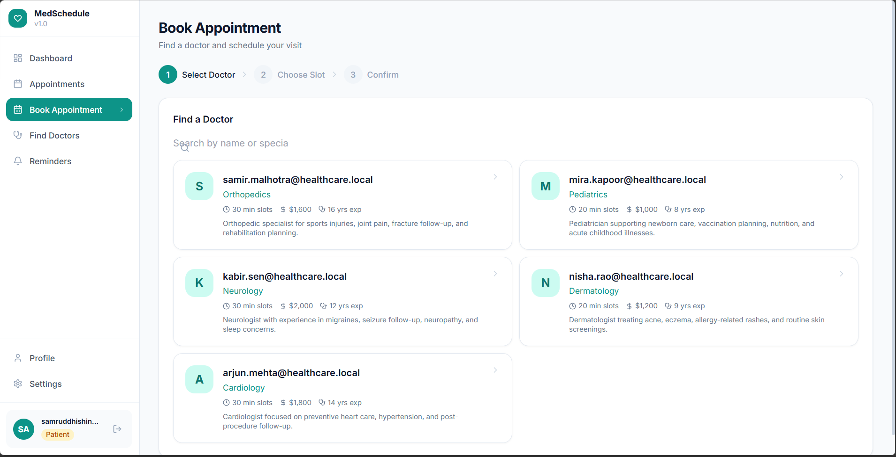
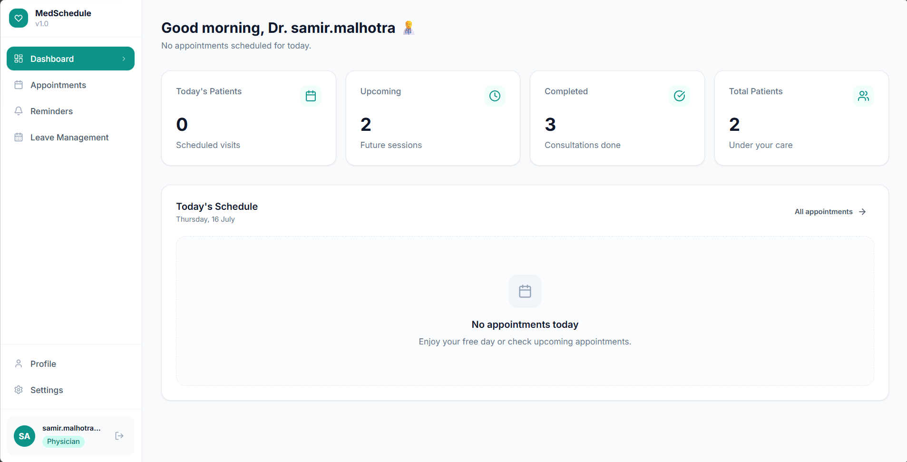
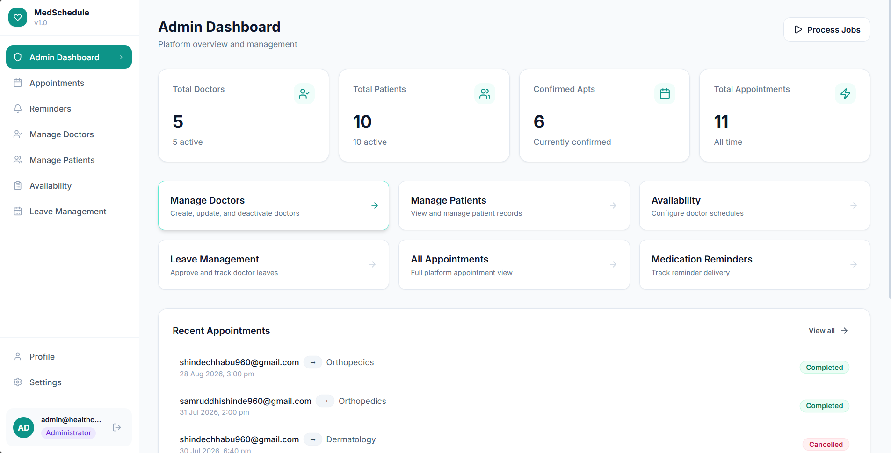

# Healthcare Appointment Manager

Healthcare Appointment Manager is a production-oriented full-stack assignment for managing appointments, doctor availability, leave, AI visit summaries, notifications, email delivery records, Google Calendar synchronization, background jobs, and medication reminders.

The project is intentionally structured like a handoff-ready engineering codebase rather than a demo. It uses strict TypeScript, layered backend modules, Prisma-backed relational data modeling, centralized validation/error handling, and role-based access control.

> **Live Demo**

Frontend: https://healthcare-appointment-manager-clie.vercel.app

Backend API: https://healthcare-appointment-manager-zfsp.onrender.com

## Demo Credentials

Admin
Email: admin@healthcare.local
Password: Admin@123

Doctor
Email: arjun.mehta@healthcare.local
Password: Admin@123

Patient
Create a new account using the registration page.
> These are development/demo credentials seeded automatically for evaluation purposes.

## Features

- Patient registration and JWT login with refresh-token rotation.
- Role-based access control for `ADMIN`, `DOCTOR`, and `PATIENT`.
- Admin doctor and patient management.
- Transaction-safe appointment booking, rescheduling, cancellation, and status updates.
- Doctor availability and leave management.
- AI-powered pre-visit and post-visit summaries with graceful fallback when AI credentials are not configured.
- Email notification service with SMTP integration (requires SMTP configuration).
- Google Calendar synchronization via OAuth (requires Google OAuth credentials).
- In-app notifications persisted in `Notification`.
- Durable background job records for AI summaries, email delivery, reminders, and calendar sync.
- Medication reminder creation, scheduling, and status updates.
- Swagger/OpenAPI documentation served by the API.

## Architecture

The backend follows a feature-based layered architecture:

```text
routes -> controllers -> services -> repositories -> Prisma/PostgreSQL
```

Supporting layers provide:

- authentication and authorization middleware;
- Zod request validation;
- centralized `ApplicationError` handling;
- Prisma client configuration;
- Winston logging;
- durable job metadata;
- provider abstractions for replaceable integrations such as calendar sync.

The frontend is a Vite + React + TypeScript application. The shared package contains cross-workspace types/constants.

## Tech Stack

Frontend:

- React
- TypeScript
- Vite
- Tailwind CSS

Backend:

- Node.js
- Express
- TypeScript
- Zod
- Winston

Database and infrastructure:

- PostgreSQL
- Prisma ORM
- Redis
- BullMQ dependency foundation

Integrations:

- OpenAI-compatible chat completion endpoint via native `fetch`
- SMTP configuration tracked through email logs
- Google Calendar API via provider abstraction

## Database Schema

The application uses PostgreSQL with Prisma ORM. The major entities are:

```text
User
│
├── PatientProfile
├── DoctorProfile
│     ├── DoctorAvailability
│     └── DoctorLeave
│
Appointment
│
├── SymptomSubmission
├── LLMSummary
├── EmailLog
├── Notification
├── CalendarConnection
├── CalendarEvent
├── MedicationReminder
└── BackgroundJob
```

Relationships are managed through Prisma models with foreign keys and transactional operations to ensure data consistency.

## Folder Structure

```text
client/                 React frontend
server/
  prisma/               Prisma schema and migrations
  src/
    ai/                 LLM summary generation
    appointments/       Appointment booking lifecycle
    auth/               JWT auth and refresh tokens
    availability/       Doctor availability
    calendar/           Google Calendar provider integration
    common/             API response, pagination, validation helpers
    config/             Environment, Prisma, Redis, logger
    docs/               OpenAPI document and Swagger UI route
    doctors/            Admin doctor management
    email/              Email delivery attempt logging
    jobs/               Durable background job records
    leave/              Doctor leave management
    middleware/         Request context, errors, not-found
    notifications/      Notification persistence service
    patients/           Admin patient management
    reminders/          Medication reminders
shared/                 Shared TypeScript exports
docs/                   Architecture and database design notes
docker/                 Dockerfiles and nginx config
```

## Installation

Prerequisites:

- Node.js 20.19 or newer
- pnpm via Corepack
- PostgreSQL
- Redis

Install dependencies:

```bash
corepack enable
pnpm install
```

## Environment Variables

Copy `.env.example` to `.env` and update the values:

```bash
cp .env.example .env
```

Important variables:

- `DATABASE_URL`: PostgreSQL connection string used by Prisma.
- `REDIS_URL`: Redis connection string.
- `JWT_SECRET`: access-token signing secret, at least 32 characters.
- `JWT_REFRESH_SECRET`: refresh-token signing secret, at least 32 characters.
- `OPENAI_API_KEY`: optional key for AI summaries.
- `OPENAI_MODEL`: model used for summary generation.
- `SMTP_HOST`, `SMTP_PORT`, `SMTP_USER`, `SMTP_PASSWORD`, `EMAIL_FROM`: email delivery configuration.
- `GOOGLE_CLIENT_ID`, `GOOGLE_CLIENT_SECRET`, `GOOGLE_REDIRECT_URI`: Google OAuth configuration.
- `CLIENT_ORIGIN`: allowed CORS origin for the frontend.
- `VITE_API_URL`: frontend API base URL.
> **Note:** AI summaries, SMTP email notifications, and Google Calendar synchronization require external credentials. The application is designed to fail gracefully when these credentials are not configured, allowing the remaining functionality to continue operating normally.

## Google Calendar Setup

1. Create a project in Google Cloud Console.
2. Enable the Google Calendar API.
3. Configure the OAuth Consent Screen.
4. Create OAuth Client credentials.
5. Add the following redirect URI:

```
http://localhost:4000/calendar/google/callback
```

6. Copy the generated credentials into your `.env` file:

```
GOOGLE_CLIENT_ID=
GOOGLE_CLIENT_SECRET=
GOOGLE_REDIRECT_URI=
```

7. Restart the backend server.

8. Open **Settings → Google Calendar** inside the application and click **Connect**.

## Database Setup

Generate Prisma Client:

```bash
pnpm --filter @healthcare/server run prisma:generate
```

Run migrations:

```bash
pnpm --filter @healthcare/server run prisma:migrate
```

Seed development data:

```bash
pnpm --filter @healthcare/server run prisma:seed
```

The seed script is idempotent and creates development users, doctors, availability, leave records, and patients.

## Running Locally

Start the full workspace in development mode:

```bash
pnpm run dev
```
The development seed script creates:

- 1 Admin account
- 5 Doctor accounts
- 8 Patient accounts
- Doctor availability
- Doctor leave records

Run:

```bash
pnpm --filter @healthcare/server run prisma:seed

Build all packages:

```bash
pnpm run build
```

Run quality checks:

```bash
pnpm run lint
pnpm run typecheck
```

## Hosted Application

Frontend

https://your-vercel-url.vercel.app

Backend

https://your-render-url.onrender.com

Swagger

https://your-render-url.onrender.com/docs

OpenAPI JSON

https://your-render-url.onrender.com/docs/openapi.json

## API Documentation

After starting the server, open:

- Swagger UI: `http://localhost:4000/docs`
- OpenAPI JSON: `http://localhost:4000/docs/openapi.json`

### Production Backend

Backend API:
https://healthcare-appointment-manager-zfsp.onrender.com

The deployed backend exposes the same REST API and Swagger documentation after deployment.

The API uses a consistent response shape:

```json
{
  "success": true,
  "data": {}
}
```

Errors use:

```json
{
  "success": false,
  "error": {
    "code": "VALIDATION_ERROR",
    "message": "Request validation failed.",
    "requestId": "..."
  }
}
```

Protected endpoints require:

```http
Authorization: Bearer <access-token>
```

## LLM Prompts

### Pre-Visit Summary Prompt

```text
You are an experienced clinical assistant.

Analyze the patient's submitted symptoms and generate a concise doctor-facing summary.

Include:
- Chief complaint
- Possible urgency
- Key observations
- Suggested follow-up questions

Do not diagnose diseases.
Keep the summary professional and concise.
```

### Post-Visit Summary Prompt

```text
You are an experienced medical assistant.

Generate a patient-friendly visit summary.

Include:
- Diagnosis (if available)
- Medications prescribed
- Follow-up recommendations
- Lifestyle advice
- Warning signs requiring urgent medical attention.

Use simple language suitable for patients.
```

## Key Design Decisions

### Transaction Safety

Appointment booking and rescheduling use Prisma transactions and the database uniqueness constraint on doctor/start time. The service validates:

- doctor existence and active status;
- patient existence and active status;
- appointment chronology;
- future start time;
- doctor leave conflicts;
- doctor availability boundaries;
- existing slot conflicts.

This makes double-booking prevention a database-backed invariant rather than only an application-level check.

### AI Integration Strategy

AI prompts live outside controllers. Services read symptom submissions or visit/prescription context, call the configured model, and persist outputs in `LLMSummary`. Failures are gracefully recorded as failed summaries so appointment workflows do not collapse when the AI provider is unavailable.
If no AI provider credentials are configured, the application stores a fallback summary instead of failing the appointment workflow.

### Email and Notifications

Email delivery attempts are persisted to `EmailLog`; in-app notifications are persisted to `Notification`. Appointment workflows trigger these services as side effects and log failures without rolling back successful appointment transactions.
SMTP credentials are intentionally excluded from the repository. Configure SMTP_HOST, SMTP_PORT, SMTP_USER, SMTP_PASSWORD, and EMAIL_FROM to enable email delivery.

### Background Job Processing

The `BackgroundJob` model is used as a durable job ledger for AI summaries, email delivery, appointment reminders, calendar synchronization, medication reminders, retries, and operational status tracking. The implementation keeps job state transitions explicit and stores attempts, schedule time, and last error metadata.

### Google Calendar

Calendar integration uses a provider abstraction. The current implementation is Google-specific, but appointment services depend on a calendar service rather than Google API details. OAuth tokens are encrypted before persistence and are never returned in API responses.
Google Calendar synchronization requires:

- GOOGLE_CLIENT_ID
- GOOGLE_CLIENT_SECRET
- GOOGLE_REDIRECT_URI

Without these credentials the application continues functioning while disabling calendar synchronization.

### Security

- JWT payloads contain only user id and role.
- Passwords are hashed with bcrypt.
- Refresh tokens are persisted and rotated.
- Password hashes and OAuth tokens are never exposed.
- Zod validates every request body/query/params object used by routes.
- Role-based authorization is centralized and reusable.
- Helmet, CORS, request ids, and centralized error responses are configured globally.

## Deployment

Recommended deployment stack:

- Frontend: Vercel
- Backend: Render or Railway
- Database: PostgreSQL
- Cache: Redis
- Email Service: SMTP
- AI Provider: OpenAI API
- Calendar Integration: Google Calendar API

The application is designed so that environment variables can be updated without requiring source code changes.

# Hosted Application

Frontend (Vercel)

https://healthcare-appointment-manager-clie.vercel.app

Backend (Render)

https://healthcare-appointment-manager-zfsp.onrender.com

## Future Improvements

- Dedicated BullMQ worker processes for background jobs.
- Automatic retry mechanism for failed email and calendar jobs.
- Refresh-token support for Google OAuth.
- Redis-based temporary slot hold mechanism.
- Integration testing for appointment booking concurrency.
- SMS and WhatsApp notifications.
- Real-time appointment updates using WebSockets.
- Monitoring dashboards using Grafana/Prometheus.
- Docker Compose production deployment.

---

# Screenshots

## Login



## Register



## Patient Dashboard



## Appointment Booking



## Doctor Dashboard



## Admin Dashboard



## Notes

Some integrations depend on external providers.

The application continues operating when these providers are not configured.

Required providers include:

- OpenAI
- SMTP
- Google Calendar OAuth

Credentials are intentionally excluded from the repository for security reasons.